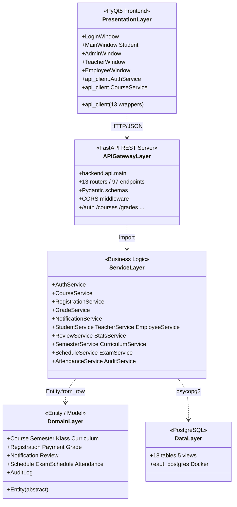

# Kiến trúc hệ thống EAUT — Client-Server REST API

## Tổng quan

```
┌──────────────────────────┐         HTTP/JSON          ┌─────────────────────────────┐
│   PyQt5 Frontend         │  ◄─────────────────────►   │   FastAPI REST Server       │
│   (frontend/main.py)     │   GET /classes/...         │   (backend/api/main.py)     │
│                          │   POST /auth/login         │   97 endpoints              │
│   - LoginWindow          │   PUT /classes/{ma}        │   - 13 routers              │
│   - AdminWindow          │   ...                      │   - Pydantic schemas        │
│   - TeacherWindow        │                            │   - CORS middleware         │
│   - EmployeeWindow       │                            │                             │
│   - MainWindow (Student) │                            │                             │
└──────────────────────────┘                            └──────────────┬──────────────┘
                                                                       │
                                                                       │ psycopg2
                                                                       ▼
                                                        ┌─────────────────────────────┐
                                                        │   PostgreSQL 16             │
                                                        │   (Docker container)        │
                                                        │                             │
                                                        │   18 tables + 5 views       │
                                                        │   eaut_postgres:5432        │
                                                        └─────────────────────────────┘
```

## 3 layer + 1 hạ tầng

| Layer | Vị trí | Stack | Trách nhiệm |
|-------|--------|-------|-------------|
| **Presentation** | `frontend/` | PyQt5, requests | UI + tương tác user, gọi REST API |
| **API Gateway** | `backend/api/` | FastAPI, Pydantic, uvicorn | HTTP endpoints, validate input, route → service |
| **Business Logic** | `backend/services/` | psycopg2, Python stdlib | Truy vấn DB, transform data, business rules |
| **Data** | `backend/database/` (schema.sql) | PostgreSQL 16 + Docker | Lưu trữ persistent |

## Sơ đồ class (Mermaid)



## Quan hệ dependency

| Layer | Phụ thuộc | Cách giao tiếp |
|-------|-----------|----------------|
| Presentation | → API Gateway | `requests.get/post/put/delete` qua `api_client.py` |
| API Gateway | → Service | Direct Python import |
| Service | → Domain + Data | `Entity.from_row(dict)`, `db.fetch_all(sql)` |
| Domain | (không phụ thuộc gì) | POPO thuần - testable, độc lập |

## Flow ví dụ: Login

```
1. User click "Đăng nhập" trong LoginWindow
2. Frontend: api_client.AuthService.login("teacher", "passtea")
3. requests.post("http://127.0.0.1:8000/auth/login", json={...})
4. FastAPI router auth.login() nhận request
5. Validate body với Pydantic LoginRequest
6. Gọi backend.services.auth_service.AuthService.login()
7. Service query DB: SELECT users + JOIN teachers
8. Build Teacher entity từ row
9. Return entity → router serialize ra dict → JSON response
10. Frontend nhận JSON → wrap vào _ApiUser → trả về cho UI
11. UI mở TeacherWindow với user.id, user.full_name, ...
```

## Flow ví dụ: Điểm danh

```
GV mark attendance:
  Frontend: AttendanceService.mark(schedule_id=1, hv_id=4, "present", "07:05", recorded_by=2)
    ↓ HTTP POST /attendance {schedule_id:1, hv_id:4, ...}
  FastAPI: attendance.mark() validate Pydantic AttendanceMark
    ↓ Python call
  Service: AttendanceService.mark() execute INSERT ... ON CONFLICT UPDATE
    ↓ psycopg2
  PostgreSQL: bảng attendance UPSERT
```

## Run.exe orchestration

`run.exe` (PyInstaller bundle ~75MB) khi double-click sẽ:

1. Check Docker Desktop có chạy không
2. `docker compose up -d postgres` → start container PostgreSQL
3. Poll `pg_isready` cho đến khi DB sẵn sàng
4. **Spawn uvicorn subprocess**: `python -m uvicorn backend.api.main:app --port 8000`
5. Poll `GET http://127.0.0.1:8000/health` cho đến khi API alive
6. Launch PyQt5 frontend (cùng process Python)
7. Khi user đóng app → cleanup: terminate uvicorn subprocess (Postgres tiếp tục chạy nền)

## Triển khai production

Để deploy thật:
- **Postgres**: VPS hoặc managed DB (Render, Supabase, AWS RDS)
- **API server**: VPS với uvicorn/gunicorn (Railway, Render, Fly.io)
- **Frontend**: User cài PyQt5 app local, set `EAUT_API_URL=https://api.eaut.example.com`

```bash
# User config
export EAUT_API_URL=https://api.eaut.example.com
python frontend/main.py
```
