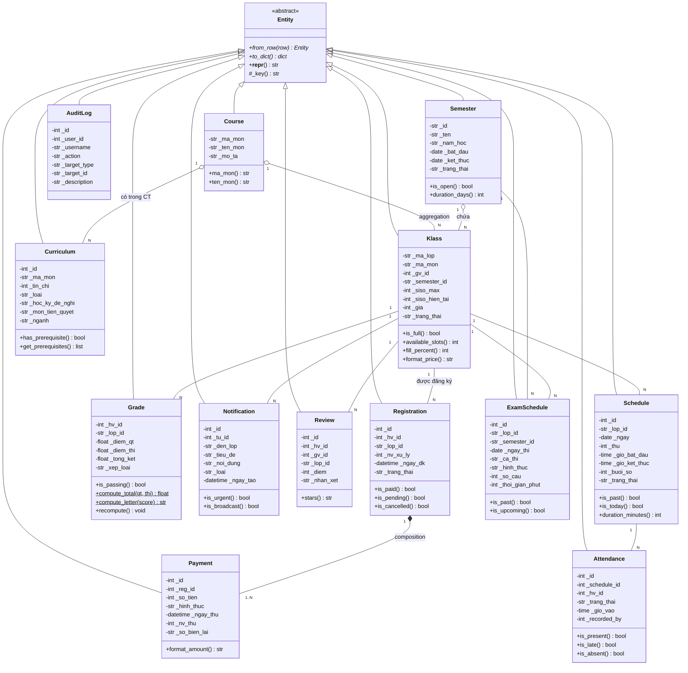
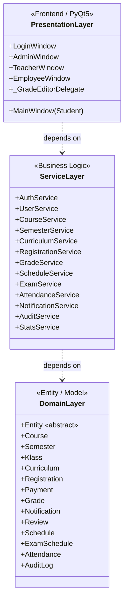

# Class Diagram — Hệ thống quản lý trung tâm ngoại khóa EAUT

> Entity hierarchy: 1 abstract base + 13 entity concrete + đầy đủ quan hệ
> Render: GitHub markdown, VS Code Mermaid Preview, [mermaid.live](https://mermaid.live)

---

## Sơ đồ lớp (Entity hierarchy)

---

## Ký hiệu Mermaid

| Ký hiệu | Ý nghĩa |
|---|---|
| `<\|--` | **Inheritance** — kế thừa |
| `*--` | **Composition** — phần tử con chết khi cha chết |
| `o--` | **Aggregation** — con tồn tại độc lập |
| `--` | **Association** — liên kết thường |
| `<<abstract>>` | Lớp trừu tượng |
| `+` / `-` / `#` | public / private / protected |
| `*` cuối method | abstract (phải override) |
| `$` cuối method | static / classmethod |

---

## 5 quan hệ UML thể hiện

| # | Quan hệ | Ví dụ trong sơ đồ |
|---|---|---|
| 1 | **Inheritance** | 13 entity kế thừa `Entity` (abstract base) |
| 2 | **Association** | `Klass ↔ Registration`, `Klass ↔ Grade` |
| 3 | **Aggregation** | `Course ◇ Klass` — môn có lớp, lớp tồn tại độc lập |
| 4 | **Composition** | `Registration ◆ Payment` — xóa ĐK = xóa thanh toán |
| 5 | **Dependency** | (thể hiện ở Service Layer, không vẽ ở đây) |

## Design Patterns

| Pattern | Áp dụng |
|---|---|
| **Abstract Base Class** | `Entity` với `@abstractmethod from_row(), to_dict()` |
| **Factory Method** | `Entity.from_row(cls, row)` — mỗi subclass tự build từ dict |
| **Template Method** | `Entity.__repr__` gọi `_key()` (lớp con override) |

## Tổng số class

| Loại | Số lượng | Tên |
|---|---|---|
| Abstract base | 1 | `Entity` |
| Academic entity | 4 | `Course`, `Semester`, `Klass`, `Curriculum` |
| Transaction entity | 3 | `Registration`, `Payment`, `Grade` |
| Communication entity | 2 | `Notification`, `Review` |
| Scheduling entity | 3 | `Schedule`, `ExamSchedule`, `Attendance` |
| Logging entity | 1 | `AuditLog` |
| **TỔNG** | **14** | |

---

## Sơ đồ kiến trúc 3 lớp (3-tier dependency)

### Quan hệ dependency giữa 3 layer

| Layer | Phụ thuộc | Lý do |
|-------|-----------|-------|
| **Presentation** | → Service | Window/Dialog gọi `AuthService.login()`, `RegistrationService.create()`, `GradeService.save_grade()`... Không truy cập DB trực tiếp |
| **Service** | → Domain | Service nhận `dict` từ DB rồi build `Entity` qua `Entity.from_row`, dùng business method (`Klass.is_full()`, `Grade.compute_total()`, `Curriculum.get_prerequisites()`) |
| **Domain** | (không phụ thuộc) | Entity là POPO thuần — không biết Service hay UI, dễ test + tái sử dụng |

> Tuân thủ **Dependency Rule** (Clean Architecture): mũi tên chỉ đi 1 chiều từ ngoài vào trong. Domain là core ổn định nhất, UI là lớp dễ thay đổi nhất.
