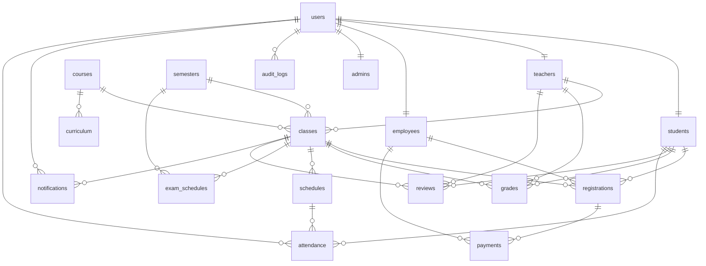

# ERD — Hệ thống quản lý trung tâm đào tạo ngoại khóa EAUT

> 18 bảng · 3 view · 4 trigger · 29 index · PostgreSQL 16
> Render: GitHub markdown, VS Code Mermaid Preview, [mermaid.live](https://mermaid.live)

---

## Sơ đồ ERD đầy đủ

```mermaid
erDiagram
    %% ========== TẦNG XÁC THỰC ==========
    users {
        int id PK
        varchar username UK "50, NOT NULL"
        varchar password "255, sha256"
        varchar role "admin/teacher/employee/student"
        varchar full_name "100"
        varchar email "100"
        varchar sdt "20"
        timestamp created_at
        boolean is_active "default TRUE"
    }

    %% ========== 4 ROLE ==========
    students {
        int user_id PK_FK "→ users.id"
        varchar msv UK "20"
        date ngaysinh
        varchar gioitinh "10"
        varchar diachi "200"
    }

    teachers {
        int user_id PK_FK "→ users.id"
        varchar ma_gv UK "20"
        varchar hoc_vi "30"
        varchar khoa "100"
        varchar chuyen_nganh "100"
        int tham_nien "default 0"
    }

    employees {
        int user_id PK_FK "→ users.id"
        varchar ma_nv UK "20"
        varchar chuc_vu "50"
        varchar phong_ban "50"
        date ngay_vao_lam
    }

    admins {
        int user_id PK_FK "→ users.id"
        varchar ma_admin UK "20"
    }

    %% ========== HỌC VỤ ==========
    courses {
        varchar ma_mon PK "20"
        varchar ten_mon "100"
        text mo_ta
    }

    semesters {
        varchar id PK "20 HK2-2526"
        varchar ten "50"
        varchar nam_hoc "20 2025-2026"
        date bat_dau
        date ket_thuc
        varchar trang_thai "open/closed/upcoming"
    }

    curriculum {
        int id PK
        varchar ma_mon FK "→ courses"
        int tin_chi "default 3"
        varchar loai "Bat buoc/Tu chon/Dai cuong"
        varchar hoc_ky_de_nghi "HK1..HK8"
        varchar mon_tien_quyet "200"
        varchar nganh "CNTT/Toan/Ngoai ngu"
    }

    %% ========== LỚP HỌC ==========
    classes {
        varchar ma_lop PK "30"
        varchar ma_mon FK "→ courses"
        int gv_id FK "→ teachers.user_id"
        varchar semester_id FK "→ semesters.id"
        varchar lich "100"
        varchar phong "20"
        int siso_max "default 40"
        int siso_hien_tai "default 0"
        numeric gia "12,0 VND"
        varchar trang_thai "open/full/closed"
        date ngay_bat_dau
        date ngay_ket_thuc
        int so_buoi "default 24"
    }

    %% ========== GIAO DỊCH ==========
    registrations {
        int id PK
        int hv_id FK "→ students"
        varchar lop_id FK "→ classes"
        int nv_xu_ly FK "→ employees"
        timestamp ngay_dk
        varchar trang_thai "pending_payment/paid/cancelled/completed"
    }

    payments {
        int id PK
        int reg_id FK "→ registrations CASCADE"
        numeric so_tien "12,0 CHECK >=0"
        varchar hinh_thuc "Tien mat/CK/VNPay/Momo"
        timestamp ngay_thu
        int nv_thu FK "→ employees"
        varchar so_bien_lai UK "50"
        text ghi_chu
    }

    grades {
        int hv_id PK_FK "→ students"
        varchar lop_id PK_FK "→ classes"
        numeric diem_qt "4,2 CHECK 0-10"
        numeric diem_thi "4,2 CHECK 0-10"
        numeric tong_ket "= 30% QT + 70% Thi"
        varchar xep_loai "A+/A/B+/.../F"
        int gv_nhap FK "→ teachers"
        timestamp updated_at
    }

    schedules {
        int id PK
        varchar lop_id FK "→ classes"
        date ngay
        int thu "CHECK 2-8"
        time gio_bat_dau
        time gio_ket_thuc
        varchar phong "20"
        int buoi_so
        varchar noi_dung "200"
        varchar trang_thai "scheduled/completed/cancelled"
    }

    exam_schedules {
        int id PK
        varchar lop_id FK "→ classes"
        varchar semester_id FK "→ semesters"
        date ngay_thi
        varchar ca_thi "50"
        time gio_bat_dau
        time gio_ket_thuc
        varchar phong "20"
        varchar hinh_thuc "Trac nghiem/Tu luan/Thuc hanh"
        int so_cau
        int thoi_gian_phut "default 90"
    }

    notifications {
        int id PK
        int tu_id FK "→ users"
        varchar den_lop FK "→ classes NULL=all"
        varchar tieu_de "200"
        text noi_dung
        varchar loai "info/warning/urgent"
        timestamp ngay_tao
    }

    %% ========== PHỤ ==========
    reviews {
        int id PK
        int hv_id FK "→ students"
        int gv_id FK "→ teachers"
        varchar lop_id FK "→ classes"
        int diem "CHECK 1-5"
        text nhan_xet
        timestamp ngay
    }

    attendance {
        bigint id PK
        int schedule_id FK "→ schedules"
        int hv_id FK "→ students"
        int recorded_by FK "→ users"
        varchar trang_thai "present/absent/late/excused"
        time gio_vao
        text ghi_chu
        timestamp recorded_at
    }

    audit_logs {
        bigint id PK
        int user_id FK "→ users NULLABLE"
        varchar username "50, denorm"
        varchar role "20"
        varchar action "50"
        varchar target_type "30"
        varchar target_id "50"
        text description
        varchar ip_address "45"
        timestamp created_at
    }

    %% ========== QUAN HỆ ==========
    users ||--|| students   : "là"
    users ||--|| teachers   : "là"
    users ||--|| employees  : "là"
    users ||--|| admins     : "là"

    courses    ||--o{ classes        : "có N lớp"
    courses    ||--o{ curriculum     : "trong CT"
    semesters  ||--o{ classes        : "chứa"
    semesters  ||--o{ exam_schedules : "có lịch thi"
    teachers   ||--o{ classes        : "phụ trách"

    classes ||--o{ registrations  : "được đăng ký"
    classes ||--o{ grades         : "có điểm"
    classes ||--o{ schedules      : "có buổi học"
    classes ||--o{ exam_schedules : "có lịch thi"
    classes ||--o{ reviews        : "được review"
    classes ||--o{ notifications  : "nhận"

    students  ||--o{ registrations : "đăng ký"
    students  ||--o{ grades        : "có điểm"
    students  ||--o{ reviews       : "gửi"
    students  ||--o{ attendance    : "điểm danh"

    teachers  ||--o{ grades  : "nhập"
    teachers  ||--o{ reviews : "được đánh giá"

    employees ||--o{ registrations : "xử lý"
    employees ||--o{ payments      : "thu tiền"

    registrations ||--o{ payments   : "thanh toán CASCADE"
    schedules     ||--o{ attendance : "có điểm danh"

    users ||--o{ audit_logs    : "tạo log"
    users ||--o{ notifications : "gửi"
    users ||--o{ attendance    : "ghi nhận"
```

---

## Phiên bản rút gọn (chỉ quan hệ, không thuộc tính)



---

## Ký hiệu Mermaid ERD

| Ký hiệu | Ý nghĩa |
|---|---|
| `\|\|--\|\|` | 1 ↔ 1 (mỗi user có đúng 1 role subtype) |
| `\|\|--o{` | 1 ↔ 0..N (1 lớp có 0 hoặc nhiều đăng ký) |
| `\|\|--\|{` | 1 ↔ 1..N (bắt buộc tối thiểu 1) |
| `}o--o{` | M ↔ N (nhiều-nhiều qua bảng trung gian) |

## Quy ước key

- **PK** — Primary Key
- **FK** — Foreign Key
- **PK_FK** — vừa PK vừa FK (vd `students.user_id` ref đến `users.id`)
- **UK** — Unique key

## 5 quan hệ UML thể hiện trong ERD

| # | Loại | Ví dụ trong DB | Constraint |
|---|---|---|---|
| 1 | Inheritance (kế thừa) | `students/teachers/employees/admins` cùng kế thừa `users` qua PK_FK `user_id` | ON DELETE CASCADE |
| 2 | Association (liên kết) | `teachers ↔ classes` qua `gv_id` | ON DELETE SET NULL |
| 3 | Aggregation (tổng hợp) | `courses ◇ classes` — môn có nhiều lớp, lớp tồn tại độc lập | ON DELETE RESTRICT |
| 4 | Composition (cấu thành) | `registrations ◆ payments` — xóa đăng ký = xóa thanh toán | ON DELETE CASCADE |
| 5 | Dependency (phụ thuộc) | `audit_logs --> users` — log tham chiếu user nhưng giữ được khi user bị xóa | ON DELETE SET NULL |
